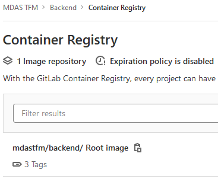
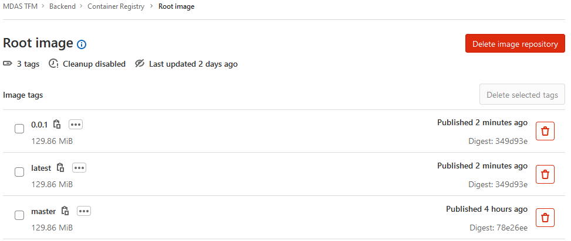

# Vibration Game Backend Application
This is the backend application for the Vibration Game. It will receive information from the frontend side and 
communicate with Apache Kafka and the Motion Predictor to provide the required functionality.

To carry out its functionality, this application uses websockets as a main mean of communication between it and the 
frontend. It also has some rest endpoints that provide some extra functionality.

## Requirements
The requirements for this application are:
- Java 11
- Docker
- Apache Kafka (if you want to run the application integrated with Kafka)
- Motion Predictor application (if you want to run the application integrated with this application)

## Folders
Apart from the folders belonging to a Spring Boot project, we have the following extra file/folders:
- **api**: folder that contains the openapi specification for this project. There are two files:
    - **vibration-async.yml**: has the definitions for the websocket part of the application.
    - **vibration-rest.yml**: has the definitions for the rest part of the application.
- **docker**: folder that contains the docker compose configuration of this application. Can deploy zookeeper (needed by 
  kafka), kafka and the backend application in docker containers.
- **docs**: folder used to store files used in the documentation like the README file. 
- **localhost.p12**: file containing a ssl certificate needed in the communication between frontend and backend. It is 
  located in the src/main/resources folder.
- **stateStore**: when running tha application with the default configuration, this folder will be created. It contains 
  the information processed from the configured KafkaStream. It acts as a database storage.

## Configuration
The following will explain the configuration parameters defined by the application.properties file located in the
src/main/resources folder.

### General
```properties
# Indicates which port the backend application will be using. Frontend will use it to send request to it.
server.port=8090
# Indicates which profiles are going to be used. There must be two defined, one that indicates which coordinates store 
# will be used and another to indicate which method will be used to check if a figure is used or not. 
# About the coordinates store, we have two options: 
# - memory: will use an in-memory repository to store the coordinates sent from frontend.
# - kafka: will use Apache Kafka to store the coordinates sent from the frontend.
# About the Motion Predictor integration, we have two options:
# - mockTensorflow: will use a mock integration with Motion Predictor to check if the list of coordinates is a valid figure.
# - tensorflow: will use a valid integration with the Motion Predictor application.
spring.profiles.active=kafka,tensorflow
```

### Logging
```properties
# Indicates the logging level for the log messages defined inside the package "com.vibration.backend".
logging.level.com.vibration.backend=INFO
```

### Security
The following properties configure the SSL connection between frontend and backend.

```properties
# Type of the key store.
server.ssl.key-store-type=PKCS12
# Path to the key store that holds the SSL certificate.
server.ssl.key-store=classpath:localhost.p12
# Password used to access the key store.
server.ssl.key-store-password=*****
# Alias that identifies the key in the key store.
server.ssl.key-alias=localhost
```

### Kafka
Kafka configuration.

```properties
# Comma-delimited list of host:port pairs to use for establishing the initial connections to the Kafka cluster.
# Use kafka:9092 when the backend is to be deployed in a docker container or localhost:9093 when running backend on local.
# Use kafka-0.kafka-headless.default.svc.cluster.local:9092 when kafka is deployed in Kubernetes using helm chart from
# bitnami (helm install kafka bitnami/kafka).
# Only use one of those values, not more than one at the same time.
spring.kafka.bootstrap-servers=kafka:9092,localhost:9093,kafka-0.kafka-headless.default.svc.cluster.local:9092
# ID to pass to the server when making requests. Used for server-side logging.
spring.kafka.client-id=VibrationGame
# Serializer class for the producer keys.
spring.kafka.producer.key-serializer=org.springframework.kafka.support.serializer.StringOrBytesSerializer
# Serializer class for the producer values.
spring.kafka.producer.value-serializer=org.springframework.kafka.support.serializer.JsonSerializer
# Application identifier for the Kafka Streams
spring.kafka.streams.application-id=VibrationGameApp
# Directory location for the state store.
spring.kafka.streams.state-dir=./stateStore
# Setting commit.interval.ms to 0 is necessary for processing the stream data as soon as possible 
spring.kafka.streams.properties.commit.interval.ms=0
```

### Motion Predictor
Motion Predictor integration (when using the profile "tensorflow")

```properties
# URL where the Motion Predictor application is located
tensorflow.base.url=http://localhost:5000
```

## How to build
To build the application you only need to execute the following command in a terminal in the root folder of the project:

```./gradlew clean build```

This will generate an executable jar file that will be placed in the "build/libs" folder.

## Run in local
Go to the "build/libs" folder where the jar file has been generated and execute the following command:

```java -jar [JAR_FILENAME].jar```

This will start the application with the configuration specified in the application.properties file. If you want to 
apply a different configuration, create a new application.properties with the desired configuration and execute the 
following command:

```java -jar [JAR_FILENAME].jar --spring.config.location=[CONFIG_FILE_PATH_AND_NAME]```

## How to generate docker image
The docker image will be automatically generated when merging to the master branch or creating a tag in GitLab. This is 
configured in the file ```.gitlab-ci.yml``` that can be found in the root folder of this project. The generated docker 
image will be stored in the "Container Registry" from GitLab. The image generated from a merge in the master branch, 
will have the tag "master" attached. Meanwhile, creating a new tag (using a version number) will use said version number  
as the tag, and also update the image with the latest tag.




## Run in docker
To start the backend in a docker environment including the kafka, you need to execute the docker compose file present in 
the "docker" folder with the command ```docker-compose up -d```. This will start the zookeeper, kafka and backend 
container applications.
